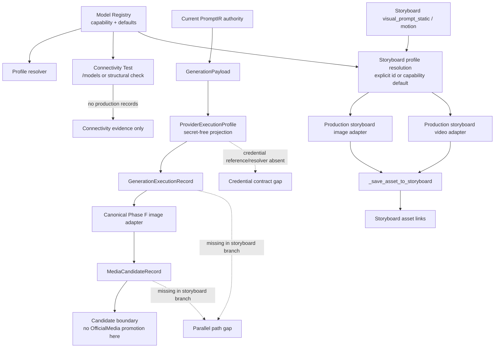

# Phase J1 Provider Integration Topology

## Decision

`PHASE_J1_PARALLEL_PROVIDER_PATH_DETECTED`

The topology below is the audited architecture. The two execution branches converge only at provider adapter code; they do not share the same authority, execution record, candidate record, or promotion boundary.

## Branch descriptions

### Canonical Phase F branch

`api/generation_canary_api.py` re-resolves current PromptIR, builds a ready `GenerationPayload`, projects the selected profile into `ProviderExecutionProfile`, and persists a `GenerationExecutionRecord` before any provider request. A successful call is persisted as `MediaCandidateRecord`. `_resolve_execution_inputs()` currently accepts only image adapters and rejects other target media with `GENERATION_CANARY_IMAGE_REQUIRED`.

### Production storyboard branch

`api/server.py` exposes `generate-frame` and `generate-video`. The queue reads the already stored storyboard static or motion prompt, resolves a profile through `resolve_generation_profile()`, and schedules `_run_creative_task()`. The task calls `generate_image_asset()` or `generate_video_asset()` and then `_save_asset_to_storyboard()`. No canonical PromptIR re-resolution, GenerationPayload fingerprint, GenerationExecutionRecord, or MediaCandidateRecord is created by this branch.

### Registry and credential branch

`api/model_registry.py` stores profile metadata and accepts `api_key`; adapters consume the raw profile key. `core/provider_execution_profile.py` intentionally projects only `credential.configured` and `credential.source_identity`, so a runtime secret reference, resolver result, and validation result are not available to the canonical execution contract. `key_configured` must not be interpreted as proof of a usable runtime credential.

## Required convergence before real execution

1. Define an authoritative Production GenerationPolicy binding for Episode/Shot model selection.
2. Make image and video storyboard routes consume the canonical execution lineage.
3. Add a secret-safe credential reference and runtime resolver/validation result to the execution boundary.
4. Preserve the candidate and validation/promotion boundaries before any OfficialMedia resolve.

This report records the gaps only. No adapter shim, fake provider, real request, or business-logic change was introduced.

