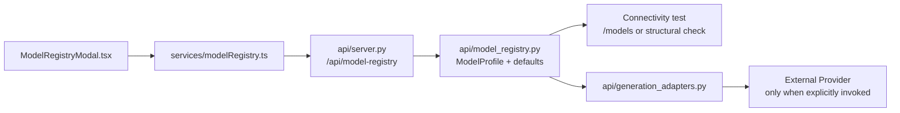
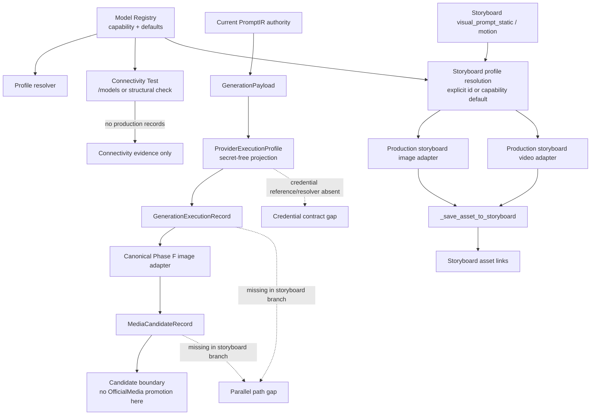

# Phase J1 Provider Integration Topology

## Decision

`PHASE_J1_PARALLEL_PROVIDER_PATH_DETECTED`

The topology below is the audited architecture. The two execution branches converge only at provider adapter code; they do not share the same authority, execution record, candidate record, or promotion boundary.

## Management topology

Management owns model identity, provider identity, capability, parameter schema, credential configuration, and enabled/default state. It does not own PromptIR, Asset Authority, MediaCandidate, or OfficialMedia.

The only shared nodes between the management and canonical production diagrams are the registry/profile and adapter primitives. The storyboard production queue does not pass through `GenerationPayload`, `ProviderExecutionProfile` fingerprinting, `GenerationExecutionRecord`, or `MediaCandidateRecord` before saving storyboard links.

## Branch descriptions

### Canonical Phase F branch

`api/generation_canary_api.py` re-resolves current PromptIR, builds a ready `GenerationPayload`, projects the selected profile into `ProviderExecutionProfile`, and persists a `GenerationExecutionRecord` before any provider request. A successful call is persisted as `MediaCandidateRecord`. `_resolve_execution_inputs()` currently accepts only image adapters and rejects other target media with `GENERATION_CANARY_IMAGE_REQUIRED`.

### Production storyboard branch

`api/server.py` exposes `generate-frame` and `generate-video`. The queue reads the already stored storyboard static or motion prompt, resolves a profile through `resolve_generation_profile()`, and schedules `_run_creative_task()`. The task calls `generate_image_asset()` or `generate_video_asset()` and then `_save_asset_to_storyboard()`. No canonical PromptIR re-resolution, GenerationPayload fingerprint, GenerationExecutionRecord, or MediaCandidateRecord is created by this branch.

### Registry and credential branch

`api/model_registry.py` stores profile metadata and accepts `api_key`; adapters consume the raw profile key. `core/provider_execution_profile.py` intentionally projects only `credential.configured` and `credential.source_identity`, so a runtime secret reference, resolver result, and validation result are not available to the canonical execution contract. `key_configured` must not be interpreted as proof of a usable runtime credential.

## Contract and currentness observations

The structured registry capability is `llm | embedding | image | video`; image and video are not inferred from model names or endpoints. Image profiles carry model/profile/provider identity, default parameters, and adapter dispatch. Video profiles additionally carry structured task-mode/reference/first-frame, duration, and aspect-ratio parameters. The contract is discoverable in `web/src/services/modelRegistry.ts`, `api/model_registry.py`, and the adapter parameter builders.

The canonical canary records the selected profile ID and fingerprint plus adapter ID/version. The storyboard task state records a profile ID/provider but lacks the canonical profile fingerprint and durable `GenerationExecutionRecord` before provider invocation. A model/default change can therefore be currentness-safe in Phase F and currentness-ambiguous in the parallel storyboard branch.

## Required convergence before real execution

1. Define an authoritative Production GenerationPolicy binding for Episode/Shot model selection.
2. Make image and video storyboard routes consume the canonical execution lineage.
3. Add a secret-safe credential reference and runtime resolver/validation result to the execution boundary.
4. Preserve the candidate and validation/promotion boundaries before any OfficialMedia resolve.

5. Require the Phase J gate independently for each capability: `human_authorized AND production_model_selected AND model_profile_current AND provider_profile_valid AND credential_resolved AND credential_validated AND adapter_available`.

6. Keep `FULL_REAL_END_TO_END_PRODUCTION_ACCEPTANCE_COMPLETE=false` until both capability paths produce auditable candidate lineage.

This report records the gaps only. No adapter shim, fake provider, real request, or business-logic change was introduced.
