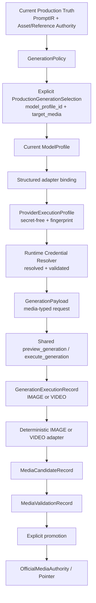

# Phase J2 Canonical Generation Convergence Design

## Decision

```text
PHASE_J2_CANONICAL_GENERATION_DESIGN_APPROVED_PENDING_IMPLEMENTATION
```

The design converges IMAGE and VIDEO on one execution service and reuses the existing execution, candidate, validation, and authority records. No production logic, migration, Provider, LLM, image, or video call was performed.

Baseline: `5487db94f9e98cbcbf647db7a12531921d18ca06` on `codex/visual-authoring-provider-canary-reconcile`.

## Target topology



Only typed payload normalization, profile capability constraints, adapter transport, and media validation parsing differ by capability. Authority, currentness, idempotency, candidate, validation, and promotion remain shared.

## One canonical service

The long-term service contract is conceptually:

```text
preview_generation(book_id, episode, shot_id, target_media, model_profile_id)
  → GenerationExecutionRecord(PREVIEWED)

execute_generation(preview_execution_id, confirmation_token)
  → GenerationExecutionRecord + MediaCandidateRecord
```

The caller does not provide a free `adapter_id`. The service resolves the adapter from the selected ModelProfile's structured binding and verifies its capability against `target_media`.

The existing Phase F preview/execute route is the nearest implementation. It should become the shared production service, with VIDEO support added inside the same context resolution and state machine. A Phase-J-only provider API is not part of this design.

## Selection contract

`ProductionGenerationSelection` is a typed request object, not part of semantic `GenerationPolicy` and not a new database table. It is mandatory for production preview and contains:

```text
target_media
model_profile_id
selection_scope (book/episode/shot)
model_profile_fingerprint at preview
selection_fingerprint
```

The service rejects an omitted profile ID, disabled profile, capability mismatch, stale profile fingerprint, or profile selected only by Registry default. The UI may use a default to prepopulate a draft, but must materialize the explicit ID before preview.

## Adapter binding review

Current Phase F preview accepts both `model_profile_id` and caller-supplied `adapter_id`, while `MODEL_ADAPTER_REGISTRY` contains generic image/video entries. That permits a ModelProfile/Adapter B combination that the profile never declared.

The target ModelProfile projection needs a structured binding (or an equivalent registry binding map):

```text
ModelProfile.capability
ModelProfile.provider
ModelProfile.model_name
ModelProfile.adapter_binding.adapter_id
ModelProfile.adapter_binding.adapter_version
ModelProfile.adapter_binding.supported_media
```

The binding is validated structurally. Provider names, URLs, model-name prefixes, and string heuristics cannot select the adapter. The business request carries no independent adapter truth.

## GenerationPayload media contract

The payload remains PromptIR-owned for creative semantics. It gains a typed `request.media` projection:

```text
media.target_media
media.task_mode
media.duration_ms
media.aspect_ratio
media.resolution
media.first_frame_binding
media.last_frame_binding
media.reference_bindings
```

Sources are structured:

- `task_mode`: explicit `GenerationPolicy.mode`.
- `duration_ms`: current PromptIR temporal duration, normalized by profile capability.
- `aspect_ratio` and `resolution`: ProviderExecutionProfile capability/default parameters; unrepresented overrides are rejected.
- frame/reference bindings: current Production Asset Authority, VisualReferenceAuthority, typed transition-frame authority, or explicitly declared current OfficialMedia authority.

The adapter receives this typed projection. It never parses `visual_prompt_*`, filenames, model names, or UI labels to create semantics.

## IMAGE and VIDEO execution

### IMAGE

```text
Current PromptIR + H2/H2.2 bindings
  → IMAGE GenerationPolicy
  → explicit image ModelProfile
  → ProviderExecutionProfile + credential gate
  → typed image GenerationPayload
  → shared execution record
  → deterministic image adapter
  → IMAGE MediaCandidate
```

### VIDEO

```text
Current PromptIR + H2/H2.2 bindings + authorized references
  → VIDEO GenerationPolicy (TEXT_TO_VIDEO or IMAGE_TO_VIDEO)
  → explicit video ModelProfile
  → ProviderExecutionProfile + credential gate
  → typed video GenerationPayload
  → the same execution record/state machine
  → deterministic async/sync video adapter
  → VIDEO MediaCandidate
```

MiniMax H3 submit, `provider_task_id`, polling, and terminal result remain one logical execution. Polling is transport progress, not a new `GenerationExecutionRecord`; logical Provider calls and transport retries remain separate.

Automatic logical generation retry remains `0`. A failed execution is terminal for that preview; any operator retry creates a new explicit preview/confirmation, while safe transport-level retry remains separately counted.

## Reference truth

For `IMAGE_TO_VIDEO`, accept only a current, fresh authority binding:

1. H2/H2.2 Production Asset Authority for the selected shot asset version.
2. `VisualReferenceAuthority` with `LOCKED`/`REFERENCE_LOCKED` status and matching current `VisualAssetPointer`.
3. Current `OfficialMediaAuthority` only when policy explicitly declares an official media reference.
4. A typed transition-frame authority recording source media, checksum, and currentness.

Reject direct `storyboard.asset_links` URLs, temporary Provider URLs, UI cache URLs, filenames, and unbound local paths as Production reference truth.

## Candidate and authority boundaries

Provider success persists only `MediaCandidateRecord`. The existing chain remains unchanged:

```text
MediaCandidate → MediaValidation → explicit promotion confirmation
  → OfficialMediaVersion → OfficialMediaAuthority → OfficialMediaPointer
```

Storyboard may render a read-only candidate preview. `_save_asset_to_storyboard()` cannot be the authority write for canonical production generation.

## Implementation acceptance criteria

1. `generate-frame` and `generate-video` delegate to the shared canonical service.
2. Production preview without explicit `model_profile_id` fails closed.
3. Adapter identity/version is derived from the profile binding.
4. IMAGE and VIDEO create the same execution/candidate lineage with media-specific payload and validation.
5. Current PromptIR, asset/reference authorities, selection, profile, and credential evidence are rechecked before execute.
6. No candidate is written directly to storyboard official links.
7. No secret appears in persisted profile/payload/fingerprint/request snapshot/log/artifact.
8. Connectivity tests remain non-production and create no execution/candidate/OfficialMedia rows.

Readiness is evaluated independently as `image_ready` and `video_ready`; IMAGE readiness never implies VIDEO readiness. Full Phase J acceptance requires every capability selected for the acceptance scope to pass its own gate.
