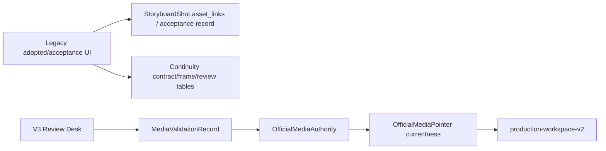

# Production UI V3 Closed Loop Convergence Audit

## Phase

`PHASE_PRODUCTION_UI_V3_CLOSED_LOOP_CONVERGENCE_AUDIT`

Baseline: `29b2708f2f6f721dabf59df60e610308d5e0cae8`  
Branch: `codex/visual-authoring-provider-canary-reconcile`  
Audit date: `2026-09-30`

## Final marker

`PRODUCTION_UI_V3_CLOSED_LOOP_CONVERGENCE_AUDIT_COMPLETE`

## Scope and evidence rule

This is a read-only convergence audit. It inspected the current implementation and actual frontend callers. It does not change production behavior, routes, schemas, migrations, provider adapters, or default flags. Each conclusion cites a path, symbol, endpoint, current behavior, semantic difference, and recommendation.

No real LLM, SHAPI, MiniMax, image provider, video provider, or production write was used. The requested SHAPI model remains a model-profile/provider configuration concern; this phase does not submit a provider request.

**Delete-nothing rule:** this phase makes no deletion, deprecation implementation, default-surface switch, route change, migration, or production behavior change. Any dead-code or deprecation candidate below is documentation only.

## Executive decision

- **V3 single-shot closed loop:** `COMPLETE_FOR_CANONICAL_SINGLE_SHOT`. `ProductWorkspaceShotStudioV3` reads the V2 projection, submits through `productionGeneration.ts`, observes the canonical V2 projection, and sends review through validation plus explicit promotion. IMAGE and VIDEO are separate lanes and are not chained automatically.
- **Legacy Storyboard:** `KEEP_AS_FALLBACK_WITH_EXPLICIT_LEGACY_BOUNDARIES`. It still owns prompt repair/compile, manual reference and adopted-media workflows, acceptance records, continuity, production-readiness repair, rollback, task-center recovery, and older creative tooling.
- **Immediate unguarded default switch:** `NO_GO`. V3 is still selected only by `?ui_v3=shot-studio`; cross-shot Review Inbox and retry/regenerate semantics are not implemented.
- **Gated default migration readiness:** `CONDITIONAL_GO`. A reversible default migration is reasonable after the gates below while retaining Legacy fallback. This is a recommendation, not an implementation performed in this phase.
- **Review Inbox:** `NO_GO`. No cross-shot queue/read-model or bulk decision backend contract exists in the inspected V3 path.
- **Retry/Regenerate:** `NO_GO` for V3. V3 renders `retry_generation` as disabled/deferred and exposes no regenerate from review or official states.

## V3 closed-loop status

| Stage | Current truth | Evidence | Status | Recommendation |
|---|---|---|---|---|
| Read workspace | Read-only V2 DTO built from current authority/pointer rows | `api/server.py:get_book_production_workspace_v2`; `core/production_workspace_projection_v2.py:build_production_workspace_projection_v2`; `web/src/services/productionWorkspace.ts:fetchProductionWorkspaceV2`; `GET /api/books/{book_id}/production-workspace-v2` | Canonical | Share now |
| Select model | Explicit IMAGE/VIDEO profile ID carried in V2 query and generation request | `ProductWorkspaceSectionContent.tsx` reads `readExplicitGenerationProfileSelection`; `productWorkspaceGeneration.ts` key `production-generation-profile-selection-v1`; `productWorkspaceShotGeneration.ts` rechecks `selected_profile_id`; `api/generation_canary_api.py` requires `model_profile_id` | Canonical with browser preference | Keep backend authority; share selector contract |
| Generate IMAGE | One canonical POST and V2 observation; no optimistic candidate | `createShotStudioGenerationController` in `web/src/services/productWorkspaceShotGeneration.ts`; `POST /api/books/{book_id}/storyboard/{episode}/{shot_id}/generate-frame`; `api/server.py:_delegate_storyboard_generation_to_canonical` | Complete | Share now |
| Generate VIDEO | One canonical POST and V2 observation; IMAGE_TO_VIDEO requires current canonical official IMAGE | Same controller; `generate-video`; `_resolve_image_to_video_source` path in `api/generation_canary_api.py`; V2 `source_official_image` projection | Complete | Share now |
| Observe running | `running` and `waiting_candidate` are projected from V2; foreground stop is observation abort only | `productWorkspaceShotGeneration.ts:inProgress/stopObserving`; `productionUiV3.ts:laneState`; no cancel endpoint | Complete for semantics | Keep; do not call abort a provider cancel |
| Review candidate | Validate candidate then explicit APPROVE promotion, with identity/freshness guard | `productWorkspaceShotReview.ts:createShotStudioMediaReviewController`; `web/src/services/productionWorkspace.ts:approveProductionMediaCandidate`; `POST /api/assets/candidates/{candidate_id}/validate`; `POST /api/assets/candidates/{candidate_id}/promote` | Complete per shot | Share now |
| Establish official | `OfficialMediaVersion`, `OfficialMediaAuthority`, and `OfficialMediaPointer` are created by `core.media_authority.promote_media_candidate` | `api/asset_promotion_api.py:promote_asset_candidate`; `core/production_workspace_projection_v2.py:_official_projection` | Complete | Single authority |
| Re-enter after refresh | V2 GET reconstructs lane from durable execution/candidate/official rows | `useProductionWorkspaceV2.ts`; `production-workspace-v2` has `read_only: true`, `authority_source: current_authority_pointers_only` | Complete | Keep V2 as restart truth |

## Legacy Storyboard status

Legacy is mounted when the V3 query flag is absent:

- `web/src/components/ProductWorkspaceSectionContent.tsx:isShotStudioCanaryEnabled` returns true only for `ui_v3=shot-studio`.
- The same file renders `ProductWorkspaceStoryboardSection` plus `ProductionWorkspaceV2Panel` when the flag is false.
- `ProductWorkspace.tsx` keeps storyboard as a normal workspace section and persists navigation through `productWorkspaceNavigationState.ts`.

Legacy generation is partially converged, not a second canonical production service:

- `api/server.py:_delegate_storyboard_generation_to_canonical` routes both `generate-frame` and `generate-video` to `preview_canonical_generation` and `execute_canonical_generation`.
- `ProductWorkspaceStoryboardSection.tsx:runStoryboardGeneration` sends `modelProfileId` and calls those historical endpoint names.
- The Legacy caller still sends `compileIfMissing: true`, `firstFrameAssetId`, and `referenceAssetIds` for VIDEO. The compatibility bridge resolves canonical PromptIR/source bindings server-side and does not use those fields as a second authority.
- The Legacy caller retains a defensive `task_id` branch. It calls `upsertPendingStoryboardTask`, `waitForCreativeTask`, `/api/prototyping/tasks/{task_id}`, and `/reconcile` when a response is not canonical. The current bridge normally returns `execution`/`candidate` without `task_id`; the branch remains reachable for older creative-task routes and other Legacy tools.

Generation can be shared now, but Legacy cannot be deleted because its surrounding capabilities are materially broader than V3 single-shot production.

## Workspace integration audit

| Concern | Current implementation | Evidence | Audit result |
|---|---|---|---|
| Legacy entry | `ProductWorkspaceSectionContent` renders `ProductionWorkspaceV2Panel` and `ProductWorkspaceStoryboardSection` when the flag is absent | `web/src/components/ProductWorkspaceSectionContent.tsx:263-310` | Legacy is the current default surface |
| V3 entry | The same branch renders `ProductWorkspaceShotStudioV3` only when `isShotStudioCanaryEnabled(search)` sees `ui_v3=shot-studio` | `web/src/components/ProductWorkspaceSectionContent.tsx:23-24,124,263` | Reversible canary gate; not default |
| Episode/shot URL | `ProductWorkspace.tsx:readUrlWorkspaceNavigation` reads `section`, `episode`, `shot`, and `step`; selected shot is held in `selectedStoryboardShotId` | `web/src/components/ProductWorkspace.tsx:81-106` | URL/deep-link state is shared at shell level |
| Shot selection | `onSelectShot` is passed to both V3 and Legacy; Legacy also maintains `selectedEpisode` and picks a first shot when needed | `ProductWorkspace.tsx:318-341`; `ProductWorkspaceStoryboardSection.tsx:2050-2065` | Selection is shared, rendering semantics differ |
| Mode | `workspaceViewMode` is owned by `ProductWorkspace` and passed to V3, V2 panel, Legacy, assets, tasks, and delivery | `ProductWorkspace.tsx:104,676-699`; `ProductWorkspaceSectionContent.tsx` | Shared standard/professional mode |
| Refresh | `handleRefreshAll` refreshes legacy workspace, V2, and project data; V3 also receives `onRefreshProductionWorkspaceV2` | `ProductWorkspace.tsx:132-141,609`; `ProductWorkspaceSectionContent.tsx:272` | Refresh plumbing is shared, but Legacy local recovery can add a second source |
| Model selection | Legacy storyboard and Canvas Beta write `production-generation-profile-selection-v1`; `useProductionWorkspaceV2` reads it only when refreshing; V3 only displays `lane.professional.model.selected_profile_id` and has no selector | `productWorkspaceGeneration.ts`; `ProductWorkspaceStoryboardSection.tsx:4296-4320`; `ProductWorkspaceShotStudioV3.tsx:272-282`; `useProductionWorkspaceV2.ts:47` | Model choice is not fully owned by V3; this is a default migration gate |

## Capability matrix (required audit columns)

The following matrix records the requested capability-level owner and write semantics. `CANONICAL`, `COMPATIBILITY`, `UX-ONLY`, `LEGACY`, and `NONCANONICAL` refer to the truth classification, not to the visual surface name.

| Capability | Legacy UI owner | V3 UI owner | Canonical read source | Mutation endpoint | Canonical write authority | Provider risk | Legacy local state | V3 support | Duplicate? | Migration recommendation |
|---|---|---|---|---|---|---|---|---|---|---|
| Shot navigation | `ProductWorkspaceStoryboardSection` | `ProductWorkspaceShotStudioV3` navigator | `shotsByEpisode` plus V2 shot identity | None | None | None | navigation state only | Supported | Intentional surface duplication | Share shell navigation |
| Shot selection | Legacy selected episode/shot | `focusShotId`, `onSelectShot` | Workspace project/shot identity | None | None | None | URL/navigation state | Supported | Intentional | Keep shared shell |
| Episode selection | Legacy `selectedEpisode` | V3 navigator derives episode from V2 shots | `ProductionWorkspaceV2Snapshot.episodes` plus legacy shot groups | None | None | None | URL `episode` | Supported | Yes | Normalize episode selector later |
| Production state | `ProductionWorkspaceV2Panel` plus legacy aggregate | `productionUiV3.ts:toShotStudioViewModel` | `GET /production-workspace-v2` | None | V2 projection read-only | None | Legacy fields can be stale | Supported | Yes, two presentations | Make V2 the only production read model |
| Next Best Action | `buildStoryboardCanvasPrimaryActionPlan` and Legacy gate helpers | `productionUiV3.ts:lanePrimaryAction/shotPrimaryAction` | V2 readiness and execution/candidate/official evidence | None | V2 readiness contract | None | Legacy gate booleans | Supported with stricter fail-closed semantics | Yes, conflicting semantics possible | Share action vocabulary, not a God service |
| Model profile selection | Legacy storyboard selects profiles; Canvas Beta also writes selection | V3 has no selector; reads lane profile | V2 query selection + server profile resolver | Generation POST carries `modelProfileId` | `api/generation_canary_api.py` profile resolver | Cost/provider choice | `production-generation-profile-selection-v1` | Read-only display | Yes | Add V3/ shared selection UI before default |
| Asset readiness | Legacy readiness summaries and asset center | `lane.professional.assetReadiness` | V2 production asset authority/pointer projection | No production ingestion route | Production asset authority | None | Legacy reference/adoption fields | Supported only for existing canonical assets | Yes | Build canonical asset ingestion bridge |
| Prompt readiness | `buildShotReadiness`/Legacy compiler diagnostics | `productionUiV3.ts:isPromptStale` and V2 PromptIR | Current PromptIR pointer/version/hash | Prompt APIs below | PromptIR authority/version | LLM only on explicit compile | Legacy prompt metadata | Supported as read gate | Yes | Keep one explicit prompt boundary |
| Prompt compile | `compileSelectedShotPrompts` | None in V3 CTA | PromptIR handoff/version state | `POST .../compile-prompts`, `/async` | Prompt Version/PromptIR compiler path | Real LLM possible | Pending prompt task and summary | Not supported | No semantic duplicate | Keep Legacy until V3 draft UX |
| Prompt draft/review | `ProductWorkspacePromptDraftPanel` | None | Decision packet/prompt draft records | `POST .../prompt-drafts`, `/llm`, `/confirm`, diagnostics | Decision packet + Prompt Version | LLM only on confirmed `/llm` | React panel state | Not supported | No | Share later as Prompt domain |
| IMAGE generation | `runStoryboardGeneration('frame')` | `createShotStudioGenerationController.start` | V2 execution/candidate/official | `POST .../generate-frame` | `GenerationExecutionRecord` → candidate | Provider possible after confirmation | Legacy task fallback | Supported | Same endpoint, different client | Share typed client |
| VIDEO generation | `runStoryboardGeneration('video')` | Same controller | V2 execution/candidate/official | `POST .../generate-video` | Same canonical chain | Provider possible after confirmation | Adopted/reference fields and task fallback | Supported | Same endpoint, different inputs | Share typed client, retain Legacy inputs |
| Execution state | Legacy task payload or canonical execution branch | V2 `latest_execution` | `GenerationExecutionRecord` | Generation POST | Generation execution service | Provider status may be async | `task_id` metadata | Supported | Yes | Build execution/task adapter |
| Long-running observation | `waitForCreativeTask` and Task Center | bounded V2 refresh loop | V2 execution state | No mutation | None | Polling only | Pending task IDs | Supported for canonical execution | Different contracts | Keep separate until adapter |
| Candidate projection | Legacy canonical panel plus legacy asset list | `productionUiV3.ts:laneCandidateSummary` | V2 `candidates` with validation | None | MediaCandidateRecord | None | Legacy `assets.images/videos` | Supported | Yes | V2 is canonical |
| Candidate review | `ProductionWorkspaceV2Panel` can review; Legacy adopted panel is separate | `productWorkspaceShotReview.ts` | Candidate + technical validation | `/api/assets/candidates/{id}/validate` | `MediaValidationRecord` | None | Legacy selection/adoption state | Supported | Route facade only | Share authority route |
| Candidate validation | V2 panel / V3 review controller | Same service | MediaCandidate lineage | `/api/media-authority/candidates/{id}/validate` or `/api/assets/candidates/{id}/validate` | `core.media_authority.validate_media_candidate` | None | None | Supported | Two API facades, one core | Normalize public facade |
| Candidate promotion | V2 panel / V3 Review Desk | Same service | Candidate + validation + currentness | `/api/assets/candidates/{id}/promote` | OfficialMedia version/authority/pointer | None | Legacy adoption is separate | Supported | Two UI entry contexts | Share now |
| Official media | Legacy displays both official and adopted | V3 only canonical official | OfficialMedia pointer/authority | Candidate promote | `OfficialMediaAuthority` chain | None | Adopted display fields | Supported | Display duplication | Never promote adoption implicitly |
| IMAGE_TO_VIDEO source binding | Legacy adopted first-frame/reference resolver | V3 canonical official IMAGE gate | V2 `source_official_image` | Video generation | OfficialMedia pointer | Provider input risk | `asset_links` adopted image | Supported only canonical | Semantic divergence | Canonicalize manual source ingestion |
| Manual media upload | `ProductWorkspaceStoryboardMediaPanel` | None | No V2 official source; legacy shot/reference rows | `POST .../manual-media-assets`; `POST .../manual-reference-assets` | `StoryboardShot.asset_links` / `VisualReferenceAsset`, not OfficialMedia | Can become provider input in Legacy | Legacy asset links | Not supported | No | Build canonical manual ingestion/promotion |
| Reference image management | Media panel, assets section, binding helpers | V3 reads canonical bindings only | PromptIR bindings / production asset authority | Visual reference upload/patch routes | VisualReferenceAsset + asset links (non-OfficialMedia) | Provider URL/access risk | Legacy reference rows | Read-only at most | Yes | Define canonical reference authority |
| Continuity | `ProductWorkspaceStoryboardContinuityPanel` | Neutral rail only | Transition contract/frame/review rows | `/transition-contract/*`, `/transition-frames/*`, `/transition-continuity-reviews/*` | Continuity tables and adopted video evidence | Provider only on explicit fixed retry | React state plus adopted links | Not supported | No | Keep Legacy until cross-shot contract |
| Acceptance | `ProductWorkspaceStoryboardAcceptancePanel` | None | `StoryboardAcceptanceRecord` via shot output | `POST .../acceptance-records` | Acceptance record, not OfficialMedia | None | Legacy shot meta/acceptance | Not supported | Similar “approve” wording only | Keep separate |
| Decision evidence | `ProductWorkspaceStoryboardDecisionPanel` | None | Decision packet | `POST .../decision-packet/draft`, `/llm-draft` | Decision packet proposal/review | LLM on confirmation | Panel state | Not supported | No | Share as Decision domain later |
| QA | `ProductWorkspaceQaSection` and QA decision panels | None | QA workbench/readiness | QA issue/autofix endpoints | QA records | LLM/provider risk depends action | QA follow-up state | Not supported | No | Keep outside V3 generation |
| Repair | `ProductWorkspaceStoryboardRepairPanel` and section | None | Production readiness repair plan/task | `/production-readiness/repair-plan*` | Repair task, prompt/readiness versions | Provider only if repair launches generation | `repairTask` state | Not supported | No | Keep Legacy compatibility |
| Rollback | Legacy prompt and repair controls | None | Prompt version/repair baseline records | `prompt-versions/*/rollback`, repair task rollback | Version/baseline records | None | Local UI state only | Not supported | No | Keep separate from media promotion |
| Task recovery | Legacy task center/recovery | None | Creative task status endpoints | `/api/prototyping/tasks/{id}`, `/reconcile`, `/restart` | Creative task persistence | Provider possible on restart | Three recovery localStorage families | Not supported by design | No | Server-backed adapter later |
| Retry | Fixed continuity retry only in Legacy | Disabled `retry_generation` | Legacy retry attempt + frozen input | `/video-retry-attempts/{id}/confirm` or task restart | Retry attempt/task records | Provider possible, explicit confirmation | Task IDs and retry metadata | Deferred | Similar label, different contract | Specify canonical retry first |
| Regenerate | No canonical generic regenerate; Legacy can launch new task paths | No CTA | None unified | No V3 endpoint | None | Provider/cost risk undefined | Legacy asset versioning | Deferred | No | Do not alias Generate |
| Production details | Legacy raw shot/prompt panels | V3 professional read-only details | V2 evidence DTO | None | None | None | Legacy raw fields | Supported with different detail sets | Presentation duplication | Keep separate standard/professional views |
| Delivery handoff | Legacy canvas/export/delivery flows | None | Delivery/export records and shot outputs | Delivery endpoints | Delivery records, not OfficialMedia promotion | Provider none | Legacy output/adoption data | Not supported | No | Keep Legacy until delivery parity |

## Call graphs

```mermaid
flowchart LR
  L[Legacy Storyboard runStoryboardGeneration] --> E[POST generate-frame / generate-video]
  E --> B[_delegate_storyboard_generation_to_canonical]
  B --> P[preview_canonical_generation]
  B --> X[execute_canonical_generation]
  X --> G[GenerationExecutionRecord]
  X --> C[MediaCandidateRecord]
  L --> T[task_id fallback]
  T --> TS[/prototyping/tasks/{id}/status/reconcile/restart]

  V[V3 Shot Studio controller] --> PG[submitCanonicalProductionGeneration]
  PG --> E
  V --> R[V2 refresh loop]
  R --> G
  R --> C
  C --> RV[validate candidate]
  RV --> PR[approve/promote]
  PR --> O[OfficialMediaAuthority + Pointer + Version]
```



```mermaid
flowchart LR
  LR[Legacy page load/task center] --> LS[localStorage pending task IDs]
  LS --> ST[/prototyping/tasks/{id}]
  ST --> RC[/reconcile or /restart]
  VR2[V3 generation controller] --> RF[bounded GET production-workspace-v2 refresh]
  RF --> EX[durable execution state]
  EX --> CP[candidate projection lag / running]
```

## Full capability matrix

| Capability | V3 Shot Studio | Legacy Storyboard | Backend/endpoint owner | Semantic difference | Decision |
|---|---:|---:|---|---|---|
| V2 production read | Yes | Yes, auxiliary panel | `GET /api/books/{book_id}/production-workspace-v2`; `fetchProductionWorkspaceV2` | V3 uses V2 as its only production UI truth; Legacy also consumes legacy aggregates | Share now |
| IMAGE generation | Yes | Yes | `generate-frame` → canonical bridge | V3 blocks on exact `generate_image`; Legacy has wider state and task fallback | Share now |
| VIDEO generation | Yes | Yes | `generate-video` → canonical bridge | V3 uses canonical source authority; Legacy displays adopted/reference controls and sends compatibility fields | Share now, retain Legacy UX |
| Model selection | Explicit lane selection | Explicit profile controls plus persisted preference | `productWorkspaceGeneration.ts`; `model_profile_id` contract | Browser storage is convenience; backend profile is authoritative | Share now |
| Prompt readiness | Read-only gate | Readiness plus direct compile/repair | V2 `prompt_ir`; Legacy `/compile-prompts/async` | V3 uses `compileIfMissing=false`; Legacy can create Prompt Version | Keep separate until compiler UX is redesigned |
| Candidate review | Per selected shot/lane | Per shot plus older adoption/acceptance panels | `/api/assets/candidates/{id}/validate`; `/promote` | V3 creates OfficialMedia authority; Legacy may also write adoption/acceptance records | Share canonical review; deprecate duplicate adoption later |
| Official media | Canonical projection | Canonical projection plus adopted display | `OfficialMediaVersion/Authority/Pointer`; V2 projection | `legacy_adopted_is_display_only` in projection | Share now |
| Running observation | V2 bounded refresh | Creative-task polling and recovery | V2 GET vs `/api/prototyping/tasks/{task_id}` | Different execution identities and timeout semantics | Share later after task migration |
| Local recovery | None for V3 production | Pending task, summary, restart metadata in localStorage | `productWorkspaceRecovery.ts` | V3 re-enters from server V2; Legacy restores task IDs | Do not share storage payloads |
| Prompt compile | Not in generation CTA | Direct LLM compile and async task | `/api/books/{book}/storyboard/{episode}/{shot}/compile-prompts/async` | V3 must not silently call LLM | Keep separate |
| Manual reference assets | Canonical bindings only | Manual/adopted reference and first-frame workflow | Legacy reference payload and asset actions | Manual inputs are not automatically OfficialMedia | Keep Legacy until canonical ingestion |
| Acceptance record | No | Yes | `/api/books/{book}/storyboard/{episode}/{shot}/acceptance-records` | Editorial acceptance is not candidate promotion | Keep Legacy |
| Continuity | Neutral rail only | Transition contract/frame/review panels | `ProductWorkspaceStoryboardContinuityPanel.tsx` `/transition-*` endpoints | Cross-shot continuity absent in V3 DTO | Keep Legacy |
| Production repair | No | Yes | `/production-readiness/repair-plan*`, `/repair-tasks`, `/rollback` | Repairs mutate/re-anchor readiness and need audit | Keep Legacy |
| Prompt rollback | No | Yes | `prompt-versions/{id}/rollback`, `recommended-rollback` | Version rollback is not media review | Keep Legacy |
| Review Inbox | No | No cross-shot V3 contract | No queue/read model or bulk decision endpoint | Single-shot review is not Inbox parity | NO_GO |
| Retry/Regenerate | Disabled/deferred | Legacy restart/recovery exists | `/api/prototyping/tasks/{task_id}/restart` | Restarting a task is not canonical regenerate | Defer V3 |
| Task center | No direct dependency | Yes | `/api/books/{book}/creative-tasks`, status/reconcile/restart | Legacy task protocol | Keep until canonical execution task center |
| SHAPI provider selection | Profile-driven only | Profile-driven only | `api/generation_canary_api.py` profile resolver | No provider call in audit | Share profile contract |

## Truth source matrix

| Concern | Canonical source | V3 use | Legacy use | Recommendation |
|---|---|---|---|---|
| Current production state | `production-workspace-v2` from authority pointers, execution, candidates, PromptIR | Sole truth after mutation | Read beside legacy aggregate/task state | Share V2; remove inference after Legacy migration |
| Execution identity | `GenerationExecutionRecord.execution_id` and V2 `latest_execution` | Required; rejects legacy-only `task_id` | Canonical when bridge response is present, task ID elsewhere | Add one execution/task adapter later |
| Candidate identity | `MediaCandidateRecord.candidate_id` plus validation | Review identity guard | Canonical promotion or legacy adoption | Keep candidate binding |
| Official truth | `OfficialMediaPointer` → version → authority | Rendered as official | Adopted assets may be display-only | Never treat adoption as authority |
| Prompt | PromptIR current pointer/version/hash | Readiness gate; no implicit compile | Async compiler can write version | Keep compile boundary explicit |
| Model | Explicit profile ID and server resolver | Rechecked before POST | Sent by caller; frozen for task/bridge | One resolver |
| Reference/source | Canonical bindings and current official IMAGE | Does not pass arbitrary first-frame/reference IDs | Legacy exposes adopted/reference payloads | Canonicalize manual ingestion before sharing |
| Recovery | Server projection | No local recovery | localStorage task IDs and task APIs | Do not merge storage schemas |
| Source fact / ScriptIR | Existing source rows | V3 read-only | Repair/split tools controlled writes | No V3 source mutation |

## Mutation entry points and endpoint ownership

| Mutation | V3 caller | Legacy caller | Endpoint owner | Duplicate action? | Recommendation |
|---|---|---|---|---|---|
| Submit IMAGE | `createShotStudioGenerationController.start` | `runStoryboardGeneration('frame')` | `POST .../generate-frame` → canonical execution | Same backend action, different gates | Share typed contract later |
| Submit VIDEO | Same controller | `runStoryboardGeneration('video')` | `POST .../generate-video` → canonical execution | Same action; Legacy compatibility fields | Share backend |
| Validate candidate | `createShotStudioMediaReviewController` | Authority tooling | `POST /api/assets/candidates/{candidate}/validate` | Two route facades call same core | Converge public facade |
| Approve candidate | `approveProductionMediaCandidate` | Asset promotion panels | `POST /api/assets/candidates/{candidate}/promote` | Same authority mutation | Share now |
| Prompt compile | Not exposed | `compileSelectedShotPrompts` | `POST .../compile-prompts/async` | Separate Prompt Version mutation | Keep separate CTA |
| Acceptance | None | `saveAcceptanceRecord` | `POST .../acceptance-records` | Not candidate promotion | Keep Legacy-only |
| Continuity | None | `ProductWorkspaceStoryboardContinuityPanel` | `/transition-contract`, `/transition-frames`, `/transition-continuity-reviews` | Cross-shot family absent in V3 | Keep Legacy-only |
| Readiness repair | None | repair-plan/task/rollback actions | `/production-readiness/repair-plan*` | Not generation | Keep Legacy-only |
| Task restart/reconcile | None | `productWorkspaceRecovery.ts` | `/api/prototyping/tasks/{task}/reconcile`, `/restart` | Separate task protocol | Share later via adapter |

## Endpoint ownership audit

| Endpoint family | Actual frontend caller | Backend handler/owner | Writes | Provider risk | V3 / Legacy usage |
|---|---|---|---|---|---|
| `GET /api/books/{book}/production-workspace` | `useProductionWorkspace`, Legacy authority banner/panels | `api/server.py:get_book_production_workspace` → `build_production_workspace_projection` | No | 0 | Legacy and shell compatibility read |
| `GET /api/books/{book}/production-workspace-v2` | `useProductionWorkspaceV2`, V3, V2 panel, assets/tasks/delivery bundles | `api/server.py:get_book_production_workspace_v2` → `build_production_workspace_projection_v2` | No | 0 | V3 canonical; shared Legacy read |
| `POST .../generate-frame`, `POST .../generate-video` | V3 `submitCanonicalProductionGeneration`; Legacy `runStoryboardGeneration` | `api/server.py:generate_storyboard_frame/video` → canonical preview/execute bridge | Execution/candidate rows; provider only after confirmation | Yes | Both; same backend bridge |
| `POST /api/media-authority/candidates/{id}/validate` | `validateProductionMediaCandidate`; V2 panel | `api/media_authority_api.py` → `validate_media_candidate` | Validation row | No | Legacy V2 panel and service alias |
| `POST /api/assets/candidates/{id}/validate` | Available route facade; tests/tooling | `api/asset_promotion_api.py` → same core | Validation row | No | Compatibility alias; V3 currently calls media-authority route |
| `POST /api/assets/candidates/{id}/promote` | V3 Review Desk and V2 panel | `api/asset_promotion_api.py` → `promote_media_candidate` | Promotion + OfficialMedia version/authority/pointer | No | Shared canonical review |
| `GET/POST /api/prototyping/tasks/{id}`, `/reconcile`, `/restart` | `productWorkspaceRecovery.ts`, `ProductWorkspaceTasksSection`, Legacy fallback | `api/server.py` creative task handlers | Task/retry metadata; restart can enqueue provider work | Restart may call provider | Legacy only; V3 rejects task-only response |
| `GET /api/books/{book}/creative-tasks` | Task Center | `api/server.py:get_creative_tasks` | No | No | Legacy task inventory |
| `POST .../compile-prompts`, `/compile-prompts/async` | Legacy section, Canvas, batch actions, recovery | `api/server.py:compile_storyboard_prompts(_async)` | Prompt version/compile task; direct path blocked for production profile | Direct/async compile may call LLM | Legacy only |
| `POST .../prompt-drafts`, `/prompt-drafts/{packet}/llm`, `/confirm`, `/diagnostics` | `ProductWorkspacePromptDraftPanel` | `api/server.py` prompt draft handlers | Decision packet and Prompt Version on confirm | LLM only on explicit `/llm` | Legacy only |
| `POST .../manual-media-assets` | `ProductWorkspaceStoryboardMediaPanel` | `api/server.py:upload_storyboard_manual_media_asset` | File + `StoryboardShot.asset_links` or `VisualReferenceAsset` | No provider | Legacy only |
| `POST .../visual-assets/{type}/{id}/manual-reference-assets` | Assets section/reference controls | `api/server.py:upload_visual_asset_manual_reference_asset` | File + `VisualReferenceAsset`, syncs legacy references | No provider | Legacy/assets only |
| `GET/PATCH .../visual-assets/...` | Assets section and asset actions | `api/server.py` visual asset/reference handlers | Visual asset/reference rows | LLM/provider only for explicit asset generation | Legacy/assets; not OfficialMedia |
| `POST /api/books/{book}/production-readiness/repair-plan/execute` | Legacy section repair action | `api/server.py` repair plan/task handlers | Repair task, readiness/version records | Depends on repair action; no automatic V3 call | Legacy only |
| `GET/POST .../repair-tasks/{id}`, `/rollback` | Legacy section polling and rollback | `api/server.py:get_production_repair_task` and rollback handler | Repair result/rollback records | No provider for rollback | Legacy only |
| `POST .../acceptance-records` | `ProductWorkspaceStoryboardSection:saveAcceptanceRecord` | `api/server.py:create_storyboard_acceptance_record` | `StoryboardAcceptanceRecord` and shot metadata | No | Legacy only |
| `POST .../decision-packet/draft`, `/decision-packets/{id}/llm-draft` | `ProductWorkspaceStoryboardDecisionPanel` | `api/server.py` decision packet handlers | Decision packet/proposal | LLM only on explicit confirmation | Legacy only |
| `/transition-contract/*`, `/transition-frames/*`, `/transition-continuity-reviews/*` | `ProductWorkspaceStoryboardContinuityPanel` | `api/server.py` transition handlers | Contract/frame/review/retry rows | Fixed retry can call provider | Legacy only |

The two candidate validation facades are a route duplication, not two authorities: both call `core.media_authority.validate_media_candidate`. The `assets/candidates/{id}/promote` route is the V3 explicit APPROVE path and writes the canonical OfficialMedia chain; Legacy acceptance/adoption endpoints do not.

## Polling and runtime duplication inventory

| Loop | Polls | Owner | Canonical? | Provider call? | Writes? | Still needed? |
|---|---|---|---|---|---|---|
| `productWorkspaceShotGeneration.ts` bounded refresh | `GET /production-workspace-v2` | V3 controller | Yes | No | No; observes only | Yes |
| `productWorkspaceShotReview.ts` post-promotion refresh | V2 refresh after validate/promote | V3 review controller | Yes | No | Promotion already done | Yes |
| `productWorkspaceGeneration.ts:waitForCreativeTask` | `/api/prototyping/tasks/{id}` then optional `/reconcile` | Legacy generation/recovery/batch/canvas | No for canonical production; yes for creative task protocol | Reconcile/restart may write | Yes for Legacy task flows |
| `ProductWorkspaceStoryboardSection` generation fallback | `waitForCreativeTask` after a noncanonical response | Legacy Storyboard | Compatibility | Possible through creative task | Pending task/summaries localStorage | Keep until telemetry proves unreachable |
| `ProductWorkspaceStoryboardSection` repair interval | `GET .../production-readiness/repair-tasks/{id}` every 2.5s | Legacy repair panel | Legacy repair task | No during read | React state only | Yes while repair task runs |
| `ProductWorkspaceTasksSection` interval | `loadPendingStoryboardTasks` and agent updates every 15s | Task Center | Legacy task center | Reconcile may call provider adapter | Removes local task metadata on completion | Yes for Legacy recovery |
| `ProductWorkspace` script/storyboard polling | `/api/pipeline/task/{id}` and `/pipeline/storyboard/task/{id}` every 3s | Upstream generation, not shot media | Legacy pipeline | May invoke upstream generation | Pipeline rows | Outside V3 shot loop |
| `ProductWorkspaceQaSection` bounded loop | QA workbench refresh up to 12 attempts / 1.5s | QA follow-up | QA domain | Depends on QA autofix | QA state | Outside shot generation |
| Provider runtime polling | Provider adapter submit/poll | `core/model_adapter_runtime.py`, `core/video_generation_runtime.py` | Backend canonical/creative task dependent | Yes | Execution/task terminal state | Yes for async providers |

There is no evidence that V3 and Legacy simultaneously poll the same canonical execution: V3 never reads `task_id`, and Legacy's task polling is entered only for task-shaped responses or Legacy task domains. The risk is future divergence if a compatibility response contains both execution and task IDs; the migration gate must instrument and reject duplicate observation.

## Official truth audit

| File/symbol | Current usage | Truth classification | Risk | Recommendation |
|---|---|---|---|---|
| `web/src/domain/productionUiV3.ts:isCanonicalOfficialMedia` | Requires currentness, version, authority, pointer, and matching IDs before `official` | `CANONICAL` | Low | Keep as presentation adapter |
| `core/production_workspace_projection_v2.py:_official_projection` | Resolves `OfficialMediaPointer` and validates authority/version currentness | `CANONICAL` | Low | Keep sole production official source |
| `web/src/components/ProductWorkspaceStoryboardSection.tsx:findLatestAdoptedAsset` | Chooses `assets.images/videos` item with `adopted=true` or latest item | `NONCANONICAL` legacy display/input | Can make adopted media look like an approval and drives Legacy VIDEO inputs | Label display-only; never feed V3 authority |
| `ProductWorkspaceStoryboardContinuityPanel` | Uses `has_adopted_video` as continuity handoff readiness | `LEGACY` | Adopted video is not OfficialMedia currentness | Keep in Legacy continuity contract; do not reuse as V3 official |
| `ProductWorkspaceStoryboardAcceptancePanel` | Displays `passed/approved` acceptance status | `LEGACY` | “通过采纳” can be mistaken for media promotion | Keep acceptance wording distinct from candidate promotion |
| `ProductWorkspaceV2Panel` | Calls canonical validate/promote and displays official pointer | `CANONICAL` | Shares route with V3 but not authority | Share service |
| `ProductionWorkspaceV2Snapshot.legacy_adopted_is_display_only` | Explicitly exposes boundary | `CANONICAL contract metadata` | Consumers could ignore flag | Add migration telemetry; do not remove Legacy rows |

No inspected component treats a candidate count alone as official, and no V3 path uses a local approved boolean. The false-equivalence risk is confined to Legacy adopted/acceptance/continuity wording and `asset_links` consumers.

## Generation readiness duplication

Legacy readiness is split across `canGenerateFrameFromV2`, `canGenerateVideoFromV2`, `buildStoryboardGateSummary`, `buildShotReadiness`, `hasAdoptedFrame`, `hasAdoptedVideo`, provider preflight, and executability checks in `ProductWorkspaceStoryboardSection.tsx`. V3 uses `ProductionMediaLaneViewModel.generationAllowed`, `primaryAction`, `stale`, and canonical readiness blockers from `productionUiV3.ts`.

- Obsolete for canonical V3 generation: Legacy `hasAdoptedFrame` as a proof of current IMAGE authority and any task/localStorage state as a proof of running execution.
- Still needed in Legacy: adopted frame/reference payload assembly, H3 provider-public URL preflight, continuity strict-first-frame checks, executability warning/override, and prompt compiler diagnostics.
- Conflict risk: Legacy can show “可生成” from adopted/reference state while V2 is blocked by `PRODUCTION_ASSET_INGESTION_API_AVAILABLE = False`, stale production binding, missing current PromptIR, or missing explicit profile. V3 correctly remains blocked; do not merge the booleans without a contract.

## Repair and recovery boundary

| Contract | Owner | Identity | Provider/write semantics | Must remain distinct from |
|---|---|---|---|---|
| Generation Retry | Not available in V3; fixed continuity retry in Legacy | Failed creative task + frozen input fingerprint/retry record | Explicit confirmation; may submit provider task | Task recovery and regenerate |
| Task Recovery | `productWorkspaceRecovery.ts` and Task Center | `task_id`, external task ID | Read/reconcile/restart task protocol; localStorage metadata | Canonical execution observation |
| Production Repair | Legacy readiness repair plan/task | Repair task + confirmation token + baseline version | Writes repair/readiness records; can affect many shots | Generation retry |
| Prompt Repair | Legacy `compileSelectedShotPrompts` or prompt draft panel | Prompt task/decision packet/version | Explicit LLM or no-LLM draft; creates Prompt Version on confirm | Media generation |
| QA Repair | `ProductWorkspaceQaSection` | QA issue/follow-up target | QA auto-fix/recheck contract | Production repair |
| Rollback | Legacy prompt version and repair task rollback | Prompt version or baseline version | Restores version/repair state; does not undo OfficialMedia by editing source facts | Regenerate |

## `ProductWorkspaceStoryboardSection` responsibility decomposition

`ProductWorkspaceStoryboardSection.tsx` is currently a compatibility shell and orchestration boundary, not one semantic domain. Its responsibilities are:

| Responsibility | Concrete symbols/imports | Future ownership |
|---|---|---|
| Navigation/selection | `selectedEpisode`, `selectedShotId`, `onSelectShot`, `STORYBOARD_STEPS` | Shared workspace shell; Legacy presentation |
| Prompt | `compileSelectedShotPrompts`, prompt version fetch/rollback/lock, `ProductWorkspacePromptDraftPanel`, history/authority panels | Prompt domain shared later; compiler remains explicit |
| Generation | `runStoryboardGeneration`, `canGenerateFrameFromV2`, `canGenerateVideoFromV2` | Canonical Generation service; Legacy compatibility wrapper until migrated |
| Media | `adoptedImage`, `adoptedVideo`, `ProductWorkspaceStoryboardMediaPanel` | Legacy compatibility; manual ingestion shared later |
| Recovery/runtime | `waitForCreativeTask`, recovery IDs, `persistShotExecutionSummary` | Legacy Task Recovery until execution adapter |
| Repair/QA | repair plan/task polling, split-draft apply, executability panels | Legacy repair/QA domains |
| Decision | `ProductWorkspaceStoryboardDecisionPanel` and evidence packets | Decision domain |
| Acceptance | `saveAcceptanceRecord`, AcceptancePanel | Legacy acceptance domain |
| Continuity | ContinuityPanel and transition state | Legacy continuity domain |
| Model | profile loading/selectors and localStorage persistence | Shared Model Selection service/UI; V3 currently read-only |
| Runtime/read | `productionWorkspace`, `productionWorkspaceV2`, authority banner | V2 canonical read adapter |

The file should not be split into a `ProductionEverythingService`. The safe extraction seams are Generation, Media Authority, Canonical Refresh, Model Selection, Prompt, and Task Recovery; the Legacy shell can compose them until capability parity is proven.

## Duplication audit

### Generation duplication

There is one canonical backend path for historical storyboard generation endpoints: `_delegate_storyboard_generation_to_canonical` calls `preview_canonical_generation` then `execute_canonical_generation`. Duplication is in clients: V3 uses `submitCanonicalProductionGeneration` and V2-only observation; Legacy uses `runStoryboardGeneration`, compatibility fields, and a defensive task branch. Recommendation: keep the bridge, converge callers on one typed client after Legacy task-only capabilities migrate.

### Review/adoption duplication

V3 review uses candidate identity plus validation and `/api/assets/candidates/{id}/promote`, creating OfficialMedia records through `core.media_authority`. Legacy renders adopted image/video and acceptance state; V2 explicitly marks `legacy_adopted_is_display_only: true`. Recommendation: preserve Legacy display/export, prevent new canonical flows from using adoption as authority, and classify old adoption as historical evidence later.

### Polling/recovery duplication

V3 performs a bounded V2 refresh loop and returns `in_progress` for active execution or candidate projection lag. Legacy `waitForCreativeTask` polls `/api/prototyping/tasks/{task_id}`, can call `/reconcile`, persists localStorage tasks/summaries, and can call `/restart`. These have different identities and failures. Build a server-backed adapter before removing Legacy recovery; V3 must not read Legacy task IDs.

### LocalStorage classification

| Key/module | Classification | Authority impact | Action |
|---|---|---|---|
| `production-generation-profile-selection-v1` in `productWorkspaceGeneration.ts` | UX preference | None; backend still requires explicit ID | Keep |
| `product-workspace.navigation-state.*` in `productWorkspaceNavigationState.ts` | UX navigation | None | Keep |
| `product-workspace.pending-storyboard-tasks.*` in `productWorkspaceRecovery.ts` | Legacy production recovery | Restores task IDs not in V2 | Do not use in V3 |
| `product-workspace.shot-execution-summary.*` in `productWorkspaceRecovery.ts` | Legacy display/recovery | Can show stale task metadata | Keep Legacy only |
| `product-workspace.recovery-task-meta.*` in `productWorkspaceRecovery.ts` | Legacy restart metadata | Local lineage only | Keep until task migration |
| `product-workspace.batch-task-runs.*` in `productWorkspaceBatchRuns.ts` | Batch UX bookkeeping | Not V3 authority | Keep outside migration |

## Model selection authority

V3 obtains selected profiles from V2 (`image_model_profile_id`/`video_model_profile_id` and `lane.professional.model.selected_profile_id`), then rechecks before POST. `api/generation_canary_api.py` rejects missing IDs with `PRODUCTION_MODEL_SELECTION_REQUIRED` and resolves the provider/model profile server-side. Legacy also sends `modelProfileId`, but carries task metadata and compatibility fields. Use one resolver and explicit selection contract. SHAPI should be represented by the selected profile/provider configuration; no live SHAPI call is hardcoded or made in this audit.

## Prompt compile boundary

V3 sends `compileIfMissing: false` through `productionGeneration.ts`; generation consumes current PromptIR and fails closed when stale/missing. Legacy exposes `compileSelectedShotPrompts` and `runPromptRepairAndContinue`, calling `/compile-prompts/async`, polling a prompt task, then submitting generation. Compile can call an LLM and create a Prompt Version, so it remains a separate explicit mutation. Never hide it inside the V3 generation CTA.

## Manual media/reference boundary

The current manual upload contracts are real writes, but they are not canonical production media writes:

- `ProductWorkspaceStoryboardMediaPanel:ManualMediaUploadCard` posts multipart data to `POST /api/books/{book}/storyboard/{episode}/{shot}/manual-media-assets`.
- For `targetKind=image`, `api/server.py:upload_storyboard_manual_media_asset` stores a file and appends an adopted item to `StoryboardShot.asset_links.images` through `_save_asset_to_storyboard`.
- For `targetKind=reference-image`, it creates a `VisualReferenceAsset`, then `_sync_visual_reference_asset_to_storyboard` updates Legacy reference bindings.
- The asset-center route `POST /api/books/{book}/visual-assets/{asset_type}/{asset_id}/manual-reference-assets` also creates `VisualReferenceAsset` and syncs Legacy bindings.
- Neither route creates `GenerationExecutionRecord`, `MediaCandidateRecord`, `MediaValidationRecord`, `OfficialMediaVersion`, `OfficialMediaAuthority`, or `OfficialMediaPointer`.
- `core/production_workspace_projection_v2.py` sets `PRODUCTION_ASSET_INGESTION_API_AVAILABLE = False`. When required entity media is missing, V2 emits `UI_V2_BLOCKED_BY_PRODUCTION_ASSET_INGESTION_API` and sends the user to Assets; the manual Legacy upload does not satisfy the canonical Production Asset authority gate.

Therefore V2 can display a canonical production asset only when an existing Production Asset authority/version/pointer is present. A Legacy manual IMAGE can be previewed/adopted and used by Legacy VIDEO/reference flows, but it cannot become a canonical official IMAGE through the manual upload route. A future canonical manual-ingestion/promotion path is a product-blocking bridge for projects with missing assets; it must define checksum/metadata, authority snapshot, candidate validation, and explicit promotion before V3 exposes upload controls.

## Legacy-only and V3-only capabilities

**Legacy-only:** Prompt Compiler async task and prompt rollback; manual/adopted first-frame and multi-reference payloads; acceptance records; cross-shot continuity; production readiness repair and rollback; creative task recovery/reconcile/restart; machine prompt export and advanced tools.

**V3-only:** Single Shot Studio lane model from `productionUiV3.ts`; canonical-only post-submit observation with `running`/`waiting_candidate`; `V3_LEGACY_GENERATION_TASK_RESPONSE_UNSUPPORTED` fail-closed guard; freshness and double-submit lock; review identity/currentness guard; no post-submit cancel CTA and no optimistic execution/candidate state.

## Duplicate CTA audit

| Visible CTA family | Surfaces | Same backend action? | Semantic difference | Audit decision |
|---|---|---|---|---|
| 生成图片 | Legacy Advanced Tools and V3 Generation Controls | Yes when both call `generate-frame` canonical bridge | Legacy may show readiness from adopted/legacy state and has task fallback; V3 requires canonical V2 `generate_image` | One canonical generation owner; preserve Legacy wrapper until converged |
| 生成视频 | Legacy Advanced Tools and V3 Generation Controls | Yes for canonical bridge | Legacy can carry adopted first-frame/reference and executability override; V3 requires canonical IMAGE_TO_VIDEO source | Do not merge source semantics prematurely |
| 批准 / 验证 / 提升 | V2 panel and V3 Review Desk | Validation/promote calls same authority core | V3 always binds candidate identity/currentness; Legacy acceptance/adopt is separate wording | Keep canonical promotion explicit; do not map acceptance to promote |
| 采纳 | Legacy Media Panel / shot output | No canonical OfficialMedia mutation | Writes `asset_links` adopted flags and may feed Legacy video/reference | Legacy-only compatibility; label noncanonical |
| 验收 | Legacy Acceptance Panel | No | Writes `StoryboardAcceptanceRecord` and feedback | Keep distinct from media promotion |
| 重编提示词 | Legacy Repair Panel, Prompt Draft Panel, Canvas, batch | No | Creates Prompt Version or draft; can call LLM | Keep separate from Generate CTA |
| 恢复任务 | Legacy Task Center/Recovery | No | Reads/reconciles/restarts creative task by `task_id` | Keep Legacy until execution adapter |
| 重试 | Legacy fixed continuity retry and generic task restart | No single shared semantics | Frozen-input retry has lineage/confirmation; generic restart is task protocol | Do not expose V3 retry yet |
| 修复 / 回滚 | Legacy repair and prompt history | No | Mutates readiness/version baselines | Keep separate from generation/review |

The only confirmed duplicate mutation is the canonical generation bridge and candidate authority routes. Similar labels such as “采纳”, “验收”, and “批准” are intentionally different writes and must not be collapsed.

## Shared service candidates

| Candidate | Classification | Evidence | Next action |
|---|---|---|---|
| V2 projection/read DTO | `SHARE_NOW` | `productionWorkspace.ts`, `production_workspace_projection_v2.py` | Both surfaces consume same read model |
| Canonical generation bridge | `SHARE_NOW` | `_delegate_storyboard_generation_to_canonical` | Keep one backend mutation |
| Candidate validate/promote authority | `SHARE_NOW` | `core.media_authority`, `api/asset_promotion_api.py` | Keep one authority chain |
| Model profile resolver | `SHARE_NOW` | `api/generation_canary_api.py`, `productWorkspaceGeneration.ts` | One typed selection object |
| Canonical refresh/error normalization | `SHARE_NOW` | `productionWorkspace.ts:fetchProductionWorkspaceV2`, `ProductionWorkspaceServiceError`, V3 controller refresh/error helpers | One read/error contract; do not share Legacy task errors as execution truth |
| Cost confirmation | `SHARE_NOW` | V3 controller `confirmCost`; Legacy explicit `window.confirm` before generation/compile | Preserve explicit user boundary, then pass only confirmed execution request |
| Prompt Compiler | `SHARE_LATER` | Legacy compile actions and prompt APIs | Share after V3 draft/version UX |
| Task/execution recovery adapter | `SHARE_LATER` | `productWorkspaceRecovery.ts` vs V2 projection | Server-backed adapter; no storage merge |
| Manual media/reference ingestion | `SHARE_LATER` | Legacy reference payload code | Define authority and lineage first |
| Legacy acceptance as OfficialMedia promotion | `DO_NOT_SHARE` | Acceptance/adoption semantics differ | Keep separate |
| Continuity/repair as V3 generation service | `DO_NOT_SHARE` | Legacy transition/readiness endpoints | Separate cross-shot contract |
| Provider cancellation | `DO_NOT_SHARE` | No verified cancel endpoint | Do not add fake cancel CTA |

## Deprecation classifications

| Surface/code | Classification | Exit gate |
|---|---|---|
| Legacy `generate-frame/generate-video` names | `BRIDGE` | All callers use typed canonical client and task fallback telemetry is zero |
| Legacy task-only response branch | `KEEP_TEMPORARILY` | Execution/task adapter covers supported tasks |
| Legacy adopted media | `KEEP_DISPLAY_ONLY` | Read/export consumers use OfficialMedia |
| Legacy Prompt Compiler | `KEEP` | V3 prompt draft/version UX exists |
| localStorage task recovery | `KEEP_LEGACY` | Server-backed recovery exists |
| Legacy acceptance/continuity/repair | `KEEP` | Replacement contracts and audit trails exist |
| V3 canary query flag | `MIGRATION_CONTROL` | Rollout telemetry and rollback switch exist |
| Legacy Storyboard deletion | `DO_NOT_DEPRECATE_NOW` | All Legacy-only capabilities have replacements |
| `ProductWorkspaceStoryboardSection.tsx` orchestration shell | `KEEP_COMPATIBILITY` | It still hosts prompt, manual media, continuity, repair, QA, acceptance, delivery, and task recovery |
| `productWorkspaceRecovery.ts` | `KEEP_COMPATIBILITY` | Active Legacy task recovery and Task Center depend on its local metadata |
| `ProductWorkspaceStoryboardMediaPanel.tsx` | `DO_NOT_REMOVE_YET` | Manual upload/reference ingestion has no canonical Production Asset replacement |
| `ProductWorkspaceStoryboardAcceptancePanel.tsx` | `KEEP` | Acceptance is a downstream editorial contract, not OfficialMedia promotion |
| `ProductWorkspaceStoryboardContinuityPanel.tsx` | `KEEP` | Cross-shot continuity contract and fixed retry are absent from V3 |
| `ProductWorkspaceStoryboardRepairPanel.tsx` | `KEEP` | Production readiness repair/rollback remains Legacy-only |

## Default surface readiness

**Decision: `CONDITIONAL_GO`.** V3 is safe enough for a gated default migration only for projects that already have canonical Production Asset authority and a persisted explicit model profile. The single-shot loop has canonical reads, freshness/double-submit guards, durable candidate review, and refresh recovery. An unconditional switch is not ready because:

1. V3 remains canary-gated and has no in-surface model selector; model selection is written by Legacy/Canvas UI and read from `production-generation-profile-selection-v1`.
2. `PRODUCTION_ASSET_INGESTION_API_AVAILABLE = False`; Legacy manual upload/reference writes do not establish canonical Production Asset or OfficialMedia authority.
3. Review Inbox has no cross-shot backend contract.
4. Retry/Regenerate is deferred.
5. Legacy Prompt Compiler/draft, reference, continuity, repair/recovery, QA, and delivery workflows are absent from V3.

Recommended rollout: use an eligibility gate for projects with current canonical assets and explicit profiles, make V3 default for that cohort behind a reversible server/config flag, and retain a visible Legacy fallback. Do not delete Legacy or reinterpret its task/localStorage records in this phase.

## Review Inbox readiness

`NO_GO`. V3 operates on one selected shot (`focusShotId`, one lane, one candidate identity). V2 returns shot projections but no cross-shot queue, cursor, assignment, bulk decision, or conflict-resolution contract. An Inbox needs a server-owned query and mutation model with pagination and idempotent decisions; a UI list alone would create a second truth source.

## Retry/Regenerate readiness

`NO_GO`. `productionUiV3.ts:lanePrimaryAction` maps failed execution to `retry_generation` with label `重试生成尚未接入`; Shot Studio exposes no regenerate from review or official states. Legacy `/api/prototyping/tasks/{task_id}/restart` restarts a creative task with frozen request metadata; that is not canonical regenerate semantics. Keep deferred until execution identity, lineage, fee confirmation, stale-source policy, and review behavior are specified and tested.

## Migration ladder and gates

1. **Gate 0 — telemetry/read parity:** instrument V2 reads, canonical bridge responses, Legacy task fallback count, adoption-versus-official display, and model-selection source. Keep provider calls and source-fact mutation at zero in QA.
2. **Gate 1 — canonical asset bridge:** provide Production Asset ingestion/binding with authority snapshot, checksum/metadata validation, and explicit promotion; prove manual Legacy uploads cannot silently masquerade as canonical.
3. **Gate 2 — shared model selection:** expose one explicit selector usable from V3 and Legacy/Canvas, refresh V2 after changes, and prove server profile identity matches the POST.
4. **Gate 3 — eligible default V3 with fallback:** route only projects passing Gates 1–2 to Shot Studio by default behind a reversible flag; retain a Legacy fallback link.
5. **Gate 4 — caller convergence:** migrate Legacy production generation to the typed canonical client; remove only the unreachable task branch after telemetry is zero.
6. **Gate 5 — capability replacement:** define Prompt Compiler handoff, canonical manual-reference ingestion, and continuity/repair navigation contracts.
7. **Gate 6 — cross-shot review:** implement server-side Review Inbox read/write semantics, pagination, conflict handling, and authority reuse.
8. **Gate 7 — retry/regenerate:** specify and test canonical retry/regenerate semantics, then expose the CTA.
9. **Gate 8 — deprecation decision:** only after Gates 4–7 and active-project migration evidence classify Legacy fallback for removal.

## Rollback strategy

- Retain the canary selector and add a server/config kill switch before changing the default.
- Route affected cohorts back to Legacy without copying localStorage task IDs into V3.
- Preserve execution, candidate, validation, and OfficialMedia rows; rollback is a surface switch, not a database delete.
- Use existing prompt-version and repair rollback endpoints for those domains; do not edit source facts to undo an OfficialMedia pointer.
- Record cohort, surface, execution ID, candidate ID, and authority/pointer IDs for reconciliation.

## Risk register

| ID | Risk | Evidence | Impact | Mitigation |
|---|---|---|---|---|
| R1 | Legacy and V3 disagree on visible state | V2 projection vs Legacy task/localStorage/adopted fields | High: duplicate action or false progress | V2 shared read model; display-only labels; Gate 0 |
| R2 | Legacy `compileIfMissing: true` implies prompt mutation | `ProductWorkspaceStoryboardSection.tsx:runStoryboardGeneration` | High: Prompt Version drift before paid media call | Explicit compiler CTA; typed caller migration |
| R3 | Task fallback duplicates polling | `productWorkspaceRecovery.ts`, Task Center 15s interval | High: stale status/duplicate restart | Execution/task adapter first; Gate 4 |
| R4 | Adopted/reference media bypasses authority | `_save_asset_to_storyboard`, `VisualReferenceAsset`, Legacy adopted fields | High: IMAGE_TO_VIDEO source drift and noncanonical official claim | Official-source gate; canonical ingestion; Gate 1 |
| R5 | Review route facades drift | `/api/media-authority/*` and `/api/assets/candidates/*` call same core | Medium: API contract drift | One public facade plus alias tests |
| R6 | Aggregate V2 view does not scale to 500/1000 shots | V2 DTO has shot arrays and no cross-shot pagination | High at scale: performance/staleness | Separate pagination phase; BG-04 |
| R7 | V3 has no model selector | Shot Studio only displays `selected_profile_id`; Legacy/Canvas own writes | High: blocked users or stale profile/cost drift | Shared selector and server identity check; BG-05 |
| R8 | Manual upload looks like asset completion | V2 `asset_ingestion_api_available=false`; Legacy upload still returns ready/adopted | High: user believes production can continue when canonical gate is blocked | Label Legacy upload compatibility; Gate 1 |
| R9 | Duplicate CTA wording hides different writes | Generate, adopt, acceptance, fixed retry, and prompt compile all appear in Legacy | Medium: wrong approval or retry semantics | Mutation inventory and distinct labels |
| R10 | URL/fallback divergence | Shared URL selection plus query-only V3 gate | Medium: deep link opens a different surface after rollout | Preserve `section/episode/shot/step`, add fallback link/kill switch |

## Blocking gaps

| Gap | Evidence | Why it blocks an unconditional default | Required gate |
|---|---|---|---|
| BG-03 canonical Production Asset ingestion | `core/production_workspace_projection_v2.py:23,568-586`; manual upload handlers in `api/server.py:15201` and `15114` | Missing required entities leave V2 blocked; Legacy uploads do not create Production Asset authority | Canonical ingestion, binding, validation, and explicit promotion |
| BG-05 V3 model selection UI | `ProductWorkspaceShotStudioV3.tsx:272-282` only reads profile; selectors exist in Legacy section `4296-4320` and Canvas Beta | New V3 users can be blocked or inherit stale localStorage choice | Shared selector with server/profile recheck |
| BG-01 Unified Reviewable Read Model | V2 has per-shot arrays, no queue/cursor/assignment | Cannot build Inbox without a second client truth source | Server Review Inbox read model |
| BG-02 Unified Review Decision Contract | V3 has one-candidate APPROVE only; no bulk/changes/conflict contract | Cross-shot review semantics are undefined | Server decision contract |
| BG-06 canonical retry/regenerate semantics | `lanePrimaryAction` defers retry; Legacy restart/fixed continuity retry are different contracts | Generate cannot safely stand in for retry | Canonical execution lineage/fee/staleness contract |
| BG-04 large-scale pagination | V2 returns aggregate `shots` array; no 500/1000-shot server pagination in inspected route | 100-shot render pass does not prove production scale | Server pagination/virtualized read phase |

## One recommended next phase

`PHASE_PRODUCTION_UI_V3_LEGACY_CAPABILITY_BRIDGE`

Deliver only the highest product-blocking bridges required for a safe default cohort: canonical Production Asset ingestion/reference lineage, a shared explicit Model Selection surface consumed by V2 and V3, and telemetry/adapter work that proves Legacy canonical generation does not fall into task recovery. Keep Review Inbox, Retry/Regenerate, provider changes, and Legacy deletion as later separate phases.

## Verification baseline and audit limits

The prior implementation phase recorded: Web 57 files / 385 tests passed; backend canonical/authority tests 32 passed; web build passed; browser console/page errors 0; responsive QA at 1280/1440/1920 had no horizontal overflow. This audit and its validation use no real LLM, SHAPI, MiniMax, image/video generation, provider submission, candidate validation write, candidate promotion write, or generation write. This audit is documentation-only and final validation is rerun after report creation.
